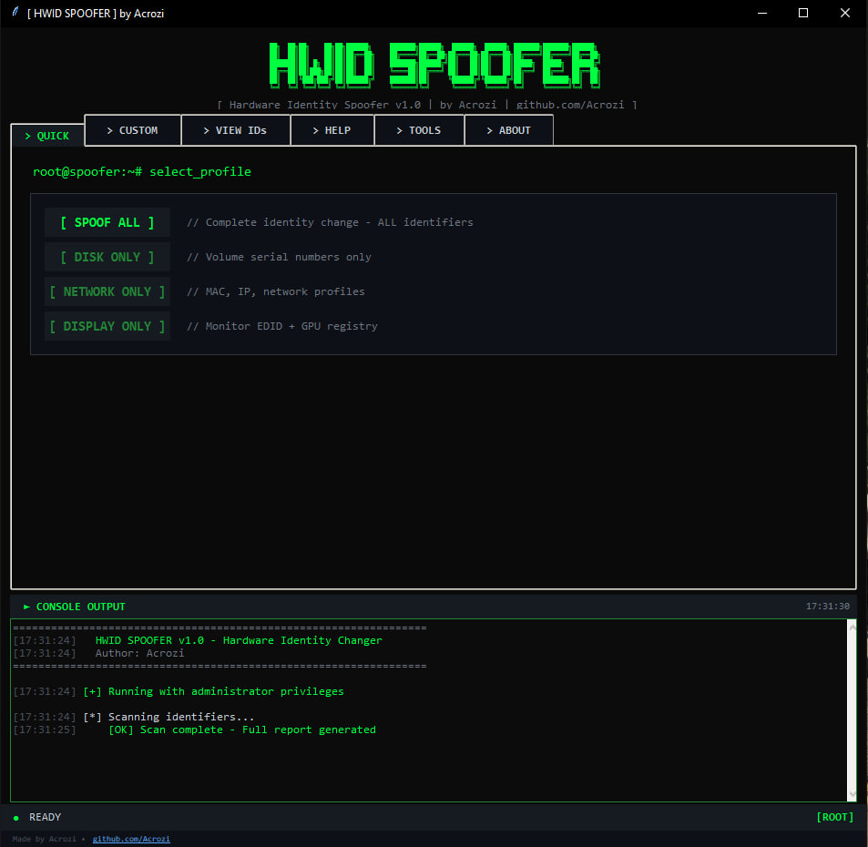
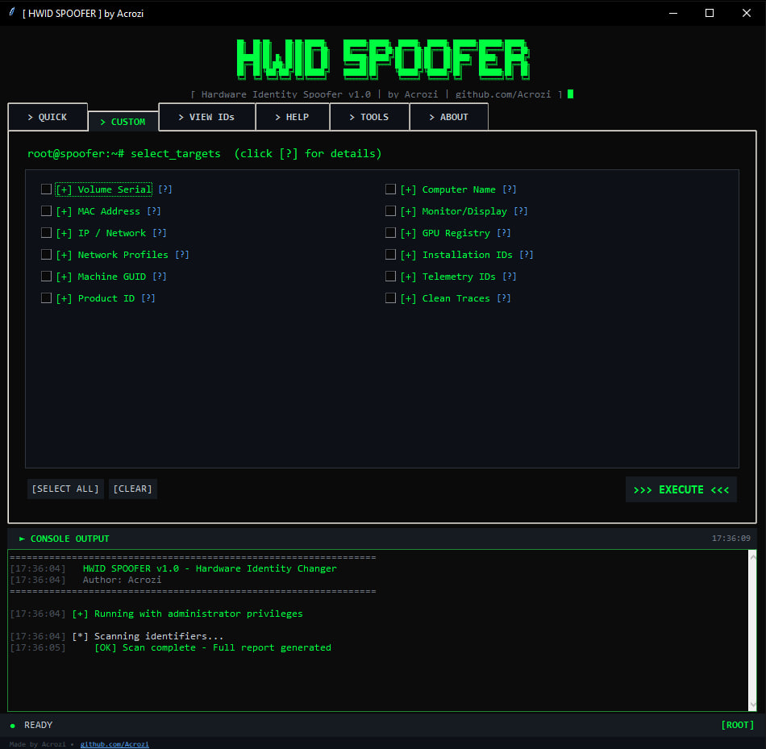
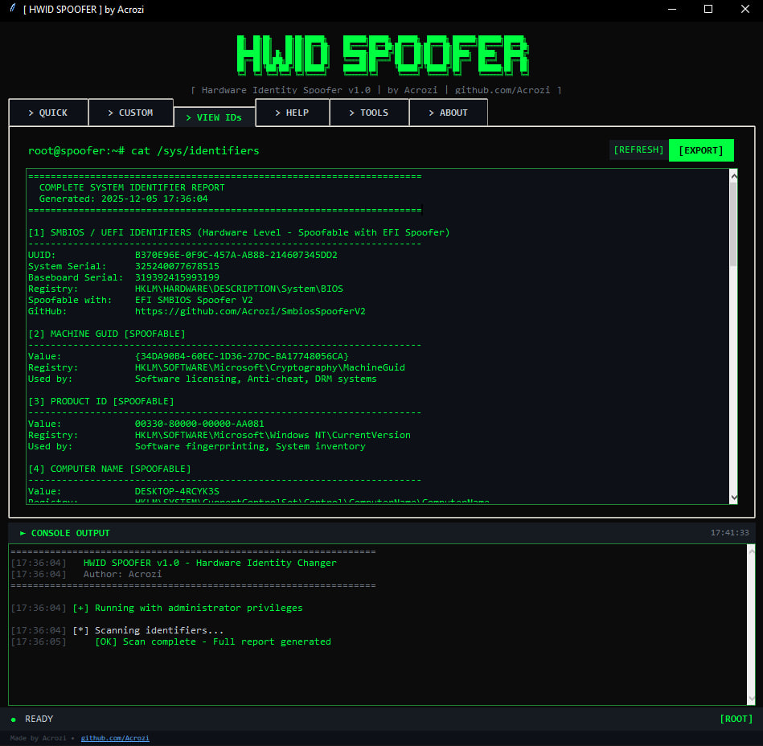
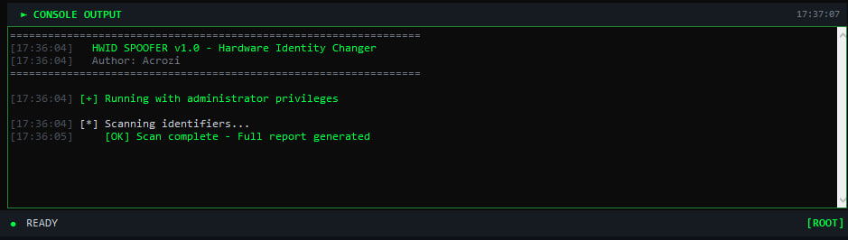
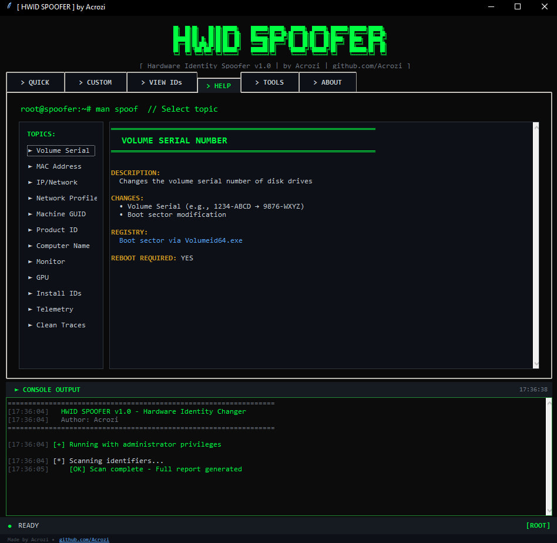

Windows Hardware ID Changer with graphical interface.

---

## Screenshots

Main interface with quick spoofing options. SPOOF ALL changes all identifiers at once.

Selective spoofing: DISKS, NETWORK, REGISTRY, HARDWARE, or CUSTOM selection.

View all current system identifiers. Export reports for comparison.

Real-time output showing spoofing progress and status.

Additional tools: Network reset, clean traces, disable S.M.A.R.T.

---

## Usage

**Quick Start:**
1. Run `HWIDSpoofer.exe` as administrator
2. Click `SPOOF ALL`
3. Restart computer

**Options:**
- `DISKS` - Volume serial numbers
- `NETWORK` - MAC addresses + network reset
- `REGISTRY` - Machine GUID, Product ID, Computer Name
- `HARDWARE` - Monitor/GPU identifiers
- `CUSTOM` - Select specific items

**Always restart after spoofing for changes to take effect.**

---

## Requirements

- Windows 10/11
- Administrator privileges
- Portable executable - no installation needed

---

## What It Changes

**Registry-Based:**
- Machine GUID, Product ID, Computer Name
- Volume Serial Numbers (all drives)
- MAC Addresses (all adapters)
- Monitor/Display IDs, GPU Registry
- Installation IDs, Telemetry IDs

**Note:** Hardware-level spoofing (CPU/Motherboard serials) requires EFI spoofer.

---

## Important

- Changes require restart to be visible
- May trigger antivirus false positives (normal for registry/system tools)
- Create system restore point before use
- Use at your own risk

---

## Disclaimer

Educational and privacy purposes only. Not responsible for bans, data loss, or system issues. May violate terms of service of some software.

---

**Author:** Acrozi | **Issues:** https://github.com/Acrozi/HWID-SPOOFER/issues
